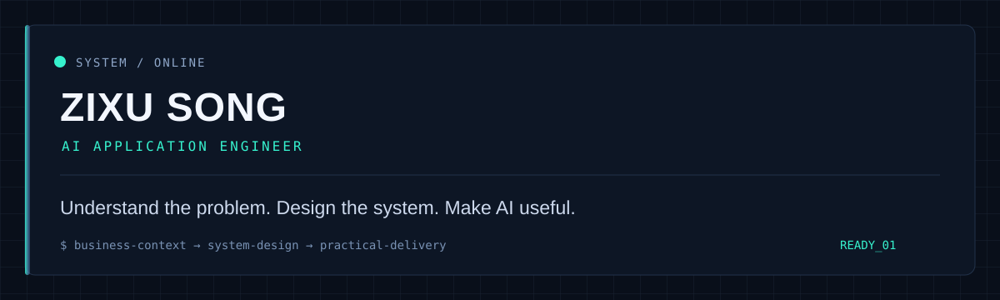

  

  Bridging business logic and technology — turning real-world requirements into practical AI systems.

## System thinking

I work where business context meets engineering decisions: clarify the real problem, choose the smallest useful system, and build an AI workflow people can actually use and evaluate.

  <code>BUSINESS CONTEXT</code> &nbsp;→&nbsp; <code>SYSTEM DESIGN</code> &nbsp;→&nbsp; <code>PRACTICAL DELIVERY</code>

## Featured system

### [FinAudit-Graph](https://github.com/water-sashuishui/FinAudit-Graph)

An end-to-end financial audit and compliance review assistant that connects document processing, retrieval, graph reasoning, AI workflows, and review automation.

- Orchestrates auditable workflows with LangGraph and LangChain.
- Grounds risk analysis in RAG with Chroma and relationship traversal in Neo4j.
- Delivers API and operator-facing entry points with FastAPI and Streamlit.
- Includes local evaluation coverage and privacy / prompt-injection safeguards.

## Capabilities

  <code>AI Agents</code> · <code>RAG</code> · <code>Knowledge Graphs</code> · <code>LangGraph</code> · <code>LangChain</code> · <code>Python</code> · <code>FastAPI</code> · <code>Neo4j</code> · <code>Chroma</code> · <code>N8N</code> · <code>Streamlit</code>

## Selected closed-source work

Some applied work remains closed-source by design. I can discuss problem framing, system trade-offs, delivery approach, and lessons learned without exposing client information, code, or sensitive data.

---

  <i>Understand the problem. Design the system. Make AI useful.</i>

